# L7 Software presents: Pixel Art Teams!

## What is this application?
Pixel Art Teams is a full stack application that allows users to create art together.

## What problem does Pixel Art Teams solve?
Building a single user pixel art maker is a trivial problem. Building a pixel art maker that multiple players can collaboratively build art together in real-time from separate computers is a rather complex problem.

## What technologies does Pixel Art Teams use?
P.A.T. is split into two projects, the app and the server. The server project can be found at: https://github.com/jhlindell/PixelArtTeams-server.

The app uses React for a front-end framework, with Redux and Thunk for state management. For layout and styling, Bootstrap, flexbox, and CSS are used.

On the server side, Node.js and Express.js are used for the server. The database and access layer is provided by PostgreSQL and KNEX.js.

Socket.io is used as a communication layer between the app and the server. This communication layer provides the ability to drive real-time updates of projects and messages.

## Deployed Full-Stack application link (Heroku)
<https://pixelart-app.herokuapp.com>

## Screenshots and Walkthrough
Upon first visiting the app, users are greeted by the home page:

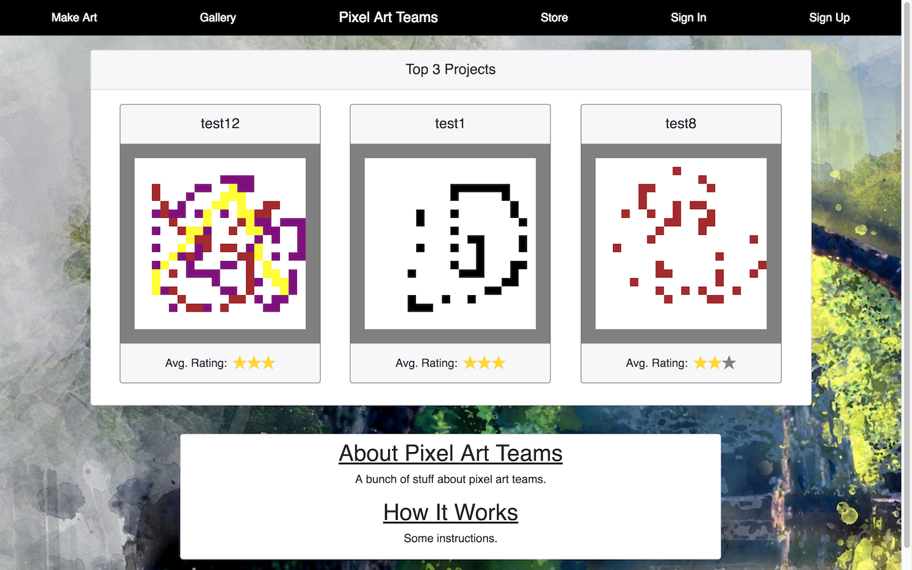

Without being logged in, the user can visit the public gallery. When a project is created, it is set to private and can be seen by the person creating it, and any other that have been invited to collaborate on it. In the public gallery you can see projects that users have promoted to public status:

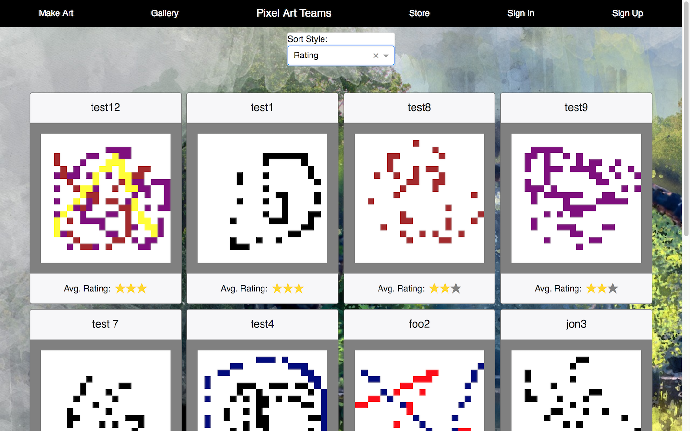

The unlogged in user would be able to visit the store as well. The store will be implemented in a future release.

At the signup page, the user is asked to come up with a username, enter an email address and password. Usernames and email addresses are unique. A user can't use an email address to create more than one account.

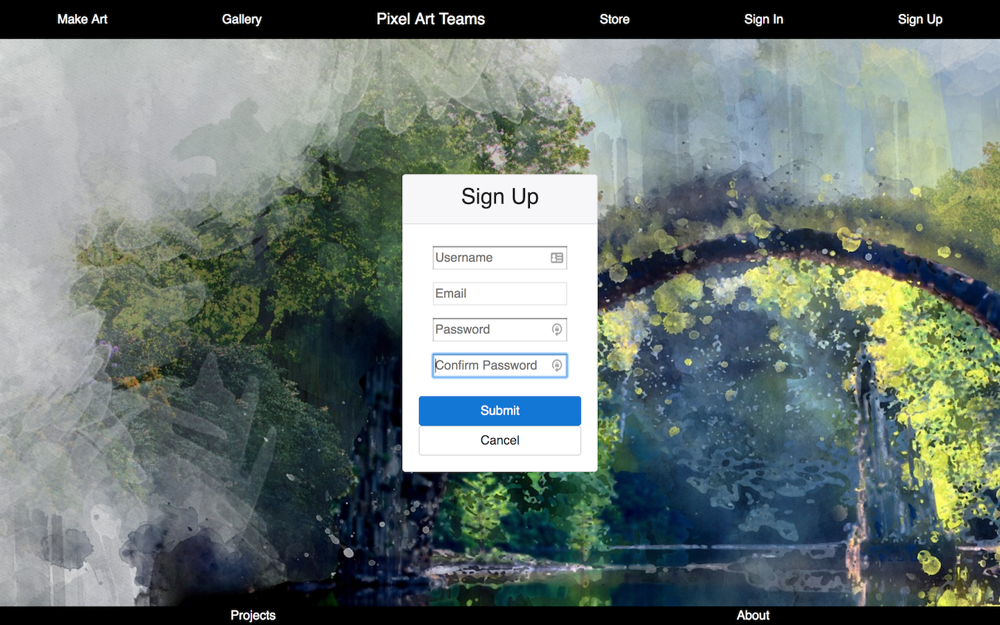

When the user submits the signup form, an email is sent to the address given. This will contain a verification link. Following the verification link verifies the user and allows them to sign in.

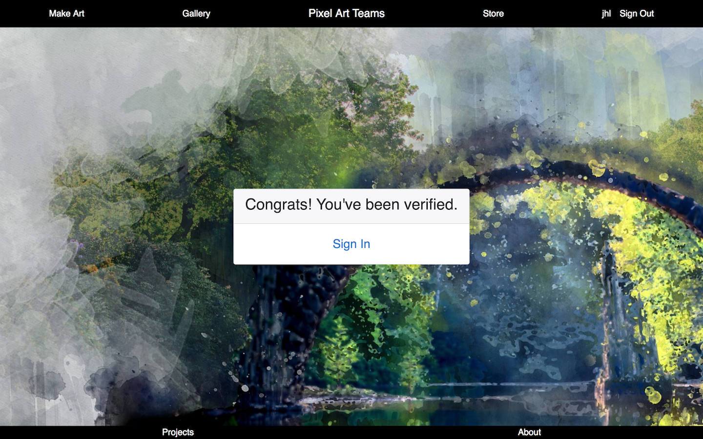

The user can then continue to the signin page to sign in. If there are signin issues, the user can click on the "Trouble Signing In" link.

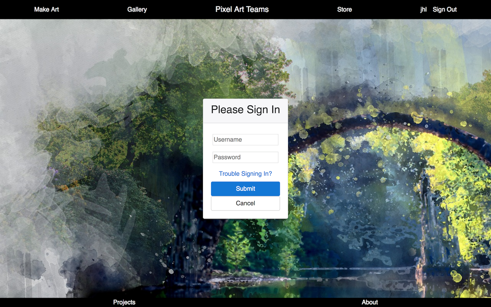

At the Sign In Trouble page, after entering the email associated with the account, the user can have the verification email resent, have their username sent if they forgot it and have a password reset link sent.

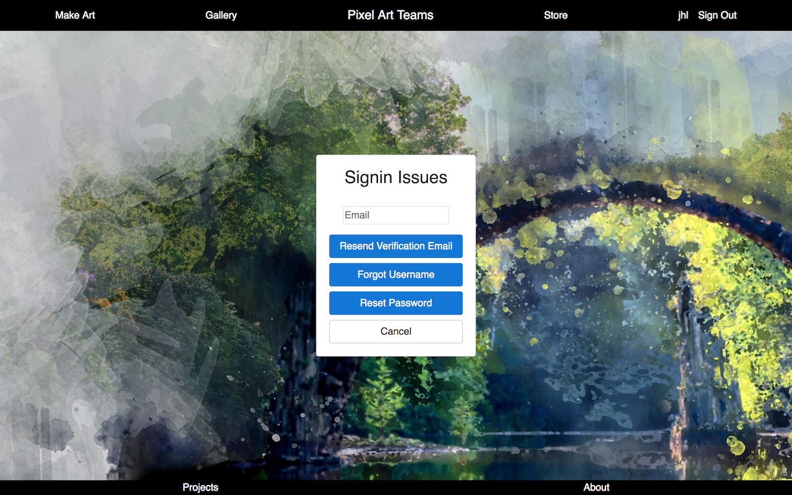

When a user signs in, they are taken to the project selector page. From here, they can start a new project or select a currently open project to work on.

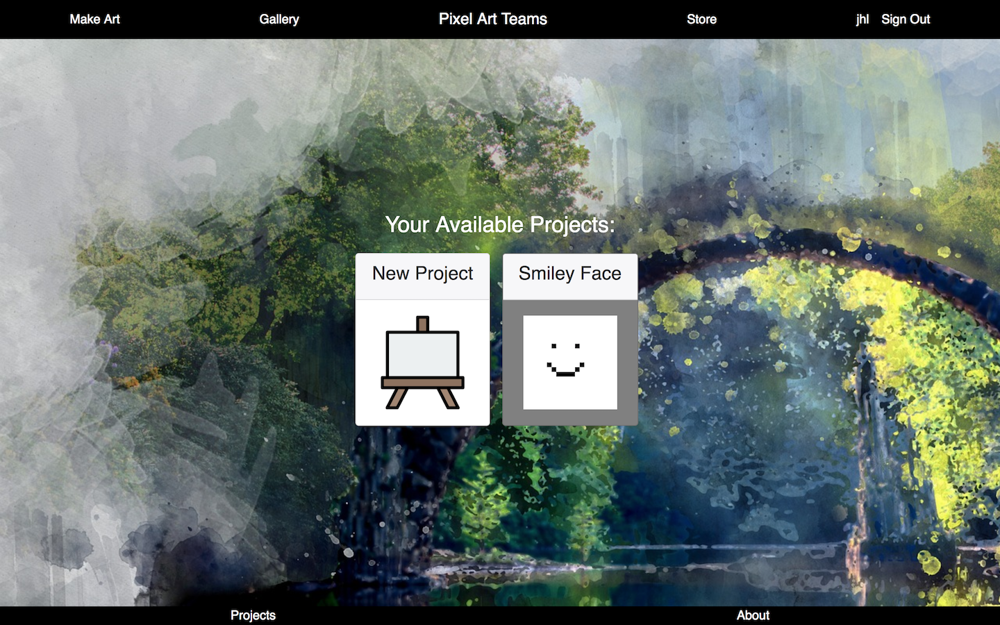

Selecting the New Project card, or clicking on the Make Art link in the navbar takes you to the New Project Page. A project name must be entered. Canvas width and canvas height are the size in pixels of the art project. These numbers must be between 10 and 40. In the middle column, the originator can select a time limit, or unlimited for the project. When the timer runs out, the project is automatically closed out and sent to the gallery. In the right column, the originator can enter friends as collaborators.

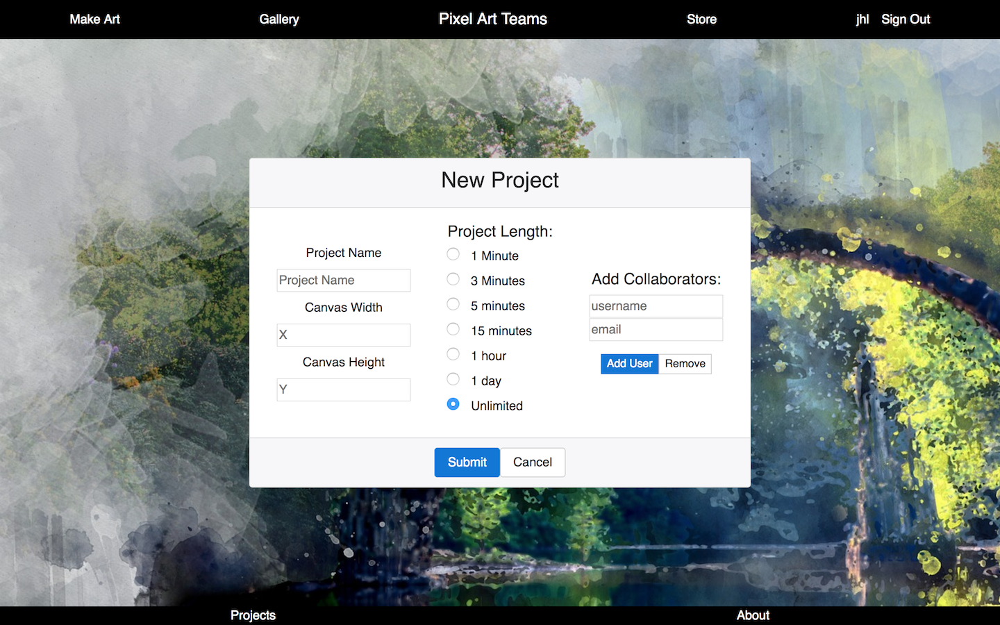

Clicking on an open project takes the user to the canvas. Here is where you make art. Clicking on one of the colors along the bottom of the canvas sets the current color. Clicking on a box in the grid sets that pixel to the current color. These updates to the canvas are live, and anyone connected to the project will see the updates in real time. Clicking and dragging works to color multiple boxes.

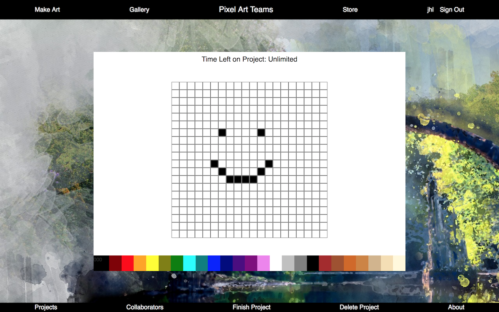

If you are the originator of a project, extra controls will appear in the footer when you are at the canvas screen. The collaborators link will take you to the collaborators page, where you can add friends to a project as collaborators. You enter the username or email address of the friend you want to add and click the "Check Name" button. If the username or email address are legitimate, the "Submit" button is activated, and you can click it to add them to the project. The list above shows the current collaborators. Clicking on a name, and clicking remove removes their permission from the project.

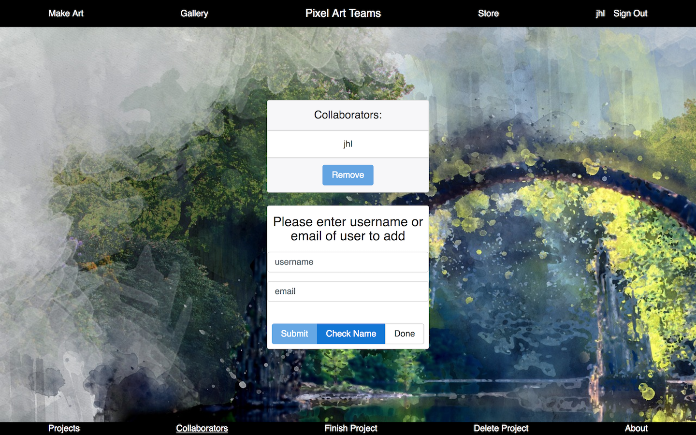

If you click on the finish link, it takes you to the finish project page. If you click on the finish button, the project is closed out and can't be worked on again. Finished projects start out as private. They can be seen in the gallery under the MyGallery sort selection by the originator of the project, and anyone who was added as a collaborator.

If you click on the delete link, it takes you to the delete project page. The delete button deletes the project. This is permanent.

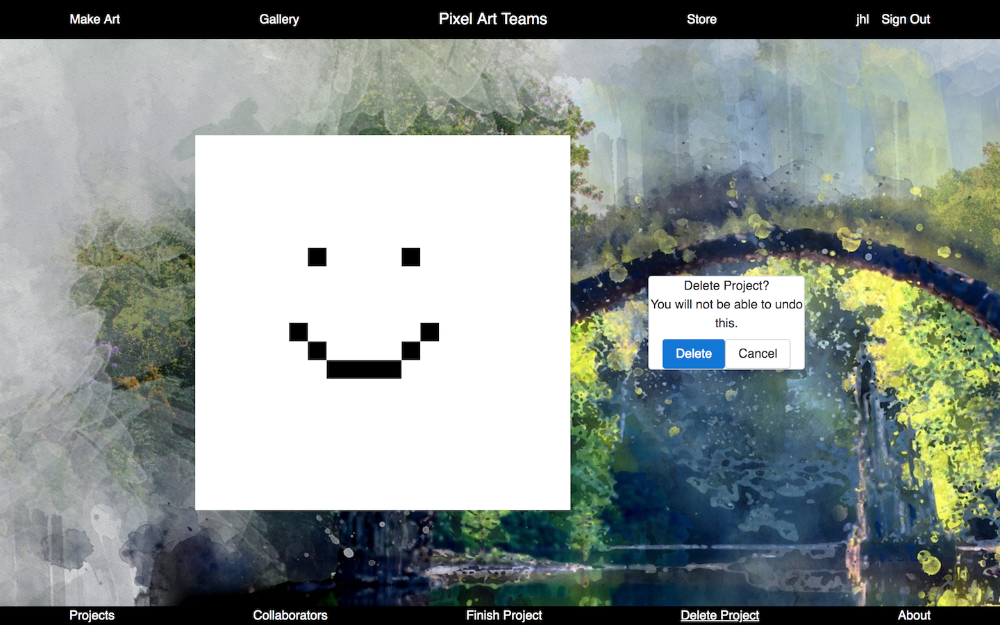

In the gallery, a user has several options for sorting the gallery art. The first is by rating. As users rate art, the ones with the best ratings make it to the top of this sort. The second option is New. This allows you to see newly submitted art. This can give newer art an option to be rated, so that it can make its way up the ratings list as well. The third option is the MyGallery option. This will show a user all projects they they either originated or were added as a collaborator to.

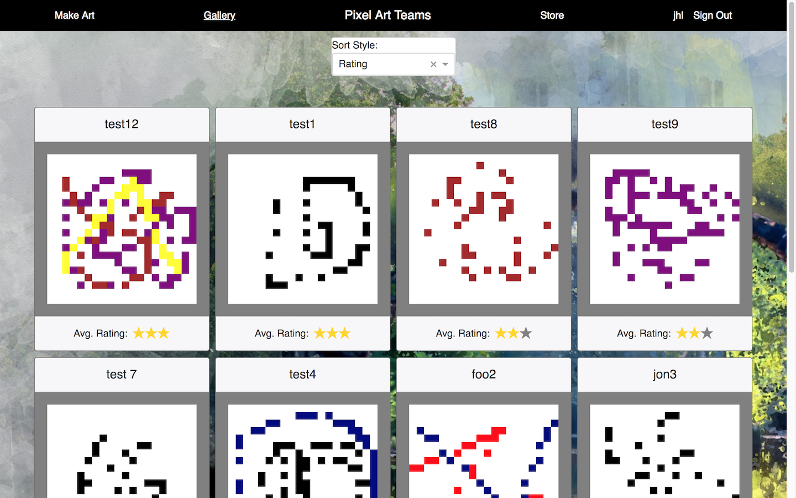

If you click on a project card in the gallery, it takes you to the show project screen. Here you can see info about the project. At the bottom the user can click on the stars to rate the project. If you are the originator of the project you can promote the project to public or delete the project. Anyone can flag the project as inappropriate. Inappropriate projects will not be shown in the public gallery any more.

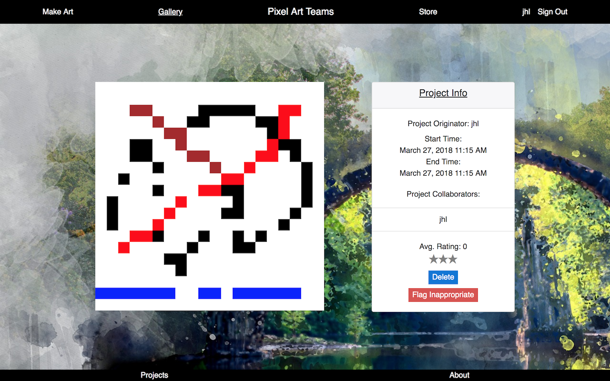
